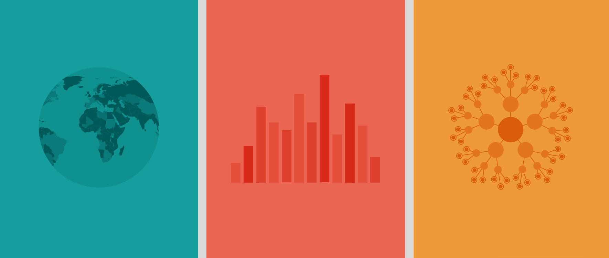

--- 
title: "NSDS Status Table"
description: ""
#date: "`r Sys.Date()`"
site: bookdown::bookdown_site
header-includes:
  - \usepackage{caption}
  - \usepackage{array}
  - \usepackage{float}
  - \hypersetup{colorlinks = true, urlcolor = cyan, citecolor = black, menucolor = black, anchorcolor = black, linkcolor=black}

favicon: "P21_icon.ico"
bibliography: Bibliography.bib
link-citations: true
keywords:
  - INE 
  - PARIS21
  - Data Science
  - ONS 
  - Data Science Accelerator 
---

<!-- From gitbook to pdf:

for pdf: bookdown::render_book("index.Rmd", "bookdown::pdf_book") 
for gitbook: bookdown::render_book("index.Rmd", "bookdown::gitbook")

From html to pdf 4 things change:
  1. uncomment last figure from knitr chunk to latex format in chapter 03.
  3. uncomment emphbox in 04.
  4. Set pdf <- TRUE to hide code chunk output and adjust kable formating in Appendix
-->


```{r setup, echo = F}
pdf <- FALSE
# Set code chunk output globally 
if (pdf) knitr::opts_chunk$set(echo = F)
```

# Progress report as of January 2023 {-}

The following tables presents the status of National Strategies for the Development of Statistics (NSDS) in International Development Association (IDA) borrower countries, Least Developed Countries, Low and Lower-Middle Income Countries, and some Upper-Middle Income Countries (in order to report on the whole of the African continent), as of January 2023. Non–IDA countries are identified in the table with an asterisk. The information is drawn from three principal sources:

  - Direct information provided by countries to PARIS21;
  - Websites of key development partners (in particular the World Bank's Bulletin Board on Statistical Capacity); and 
  - Websites of countries' national statistical offices.

The table is sorted by geographical region and provides information on existing strategy and next. It should be noted that while existing strategies may not necessarily follow the NSDS guidelines, most strategies currently being designed do follow them. This table is updated annually, and is available on the PARIS21 website at [http://www.paris21.org](http://www.paris21.org).

```{js, echo = FALSE}
title=document.getElementById('header');
title.innerHTML = '<div class="hero-image-container">  </div> <br> <br> <br> <br> <br> <br> <br> <br> <br> <br>' + title.innerHTML
```

```{r, results='hide', echo=FALSE, warning=FALSE, message=FALSE}
library(tidyverse)
library(kableExtra)
library(readxl)
``` 

<br>
<br>
<br>


```{r, echo=FALSE, warning=FALSE}
urls <- read_xlsx("./Data/Hyperlinks to NSDSs.xlsx") %>%
  select(-"Name of the Plan")

nsds_status <- readRDS("./Data/NSDS_Status_2023.RDS") %>% 
  select(-iso, -ida, -summary, -summary1, -summary2) %>%
  left_join(urls, by = "Country") %>%
  mutate(Name.of.the.Plan = ifelse(is.na(Hyperlinks), 
                                   Name.of.the.Plan, 
                                   paste0('<a href="', Hyperlinks, '" target="_blank">',Name.of.the.Plan,'</a>'))) %>%
  rename("Name of the Plan"=Name.of.the.Plan, 
         "Next Plan"=Next.Plan,
         "Region"=Reg) %>%
  select(-Hyperlinks)


nsds_africa <- nsds_status %>%
  filter(Region == "Africa") %>%
  select(-Region) 
nsds_asia_pacific <- nsds_status %>%
  filter(Region == "Asia-Pacific") %>%
  select(-Region)
nsds_asia_pacific <- nsds_status %>%
  filter(Region == "Asia-Pacific") %>%
  select(-Region)
nsds_europe <- nsds_status %>%
  filter(Region == "Eastern Europe") %>%
  select(-Region)
nsds_america_caribbean <- nsds_status %>%
  filter(Region == "Latin America and the Caribbean") %>%
  select(-Region) 
```
<br>
<br>
<br>
<br>
<br>
<br>


<!--
top_cover_image <-  paste(readLines("top_cover_image.html"), collapse="\n")
title.innerHTML = '' + title.innerHTML
-->

